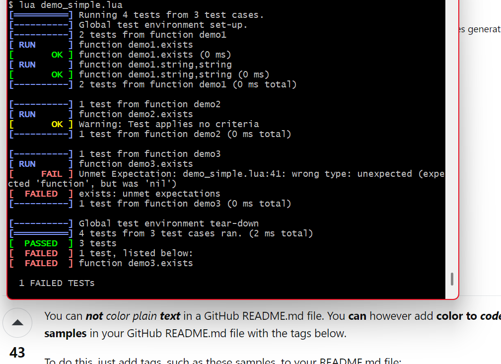

# ulutest

Ulutest is a unittest framework for Lua, which produces output very similar to
the output of googletest.

It can be used to test modules for lua (written in Lua or C).

Writing a test requires minimal information beyond what to test and
what result to expect. Ulutest produces output that is easy to
read and easy to interpret from the formulation of the test itself.
Therefore it is easy to write robust tests with minimal effort.

This output was produced with demo_simple.lua, essentially ..

    ... load system under test and ulutest ...
    ulu.RUN {
        {
            name="function demo1",
            tt("exists", function(t)
                t:ASSERT_EQ("function", type(demo1))
            end),
            tt("string,string", function(t)
                t:ASSERT_EQ("(abc,xyz)", demo1("abc","xyz"))
            end)
        },
        {
            name="function demo2",
            tt("exists", function(t)
                -- t:ASSERT_EQ("function", type(demo2))
            end)
        },
        {
            name="function demo3",
            tt("exists", function(t)
                t:EXPECT_EQ("function", type(demo3), "wrong type:")
            end)
        }
    }

# To do
## still ..
- Account for the difference in the bottom line if tests have been skipped.
- Introduce setup and teardown on a per test basis.
- Allow listing and filtering tests.
## no more
- Make ulutest process a list of tests rather than a random number of test arguments.
